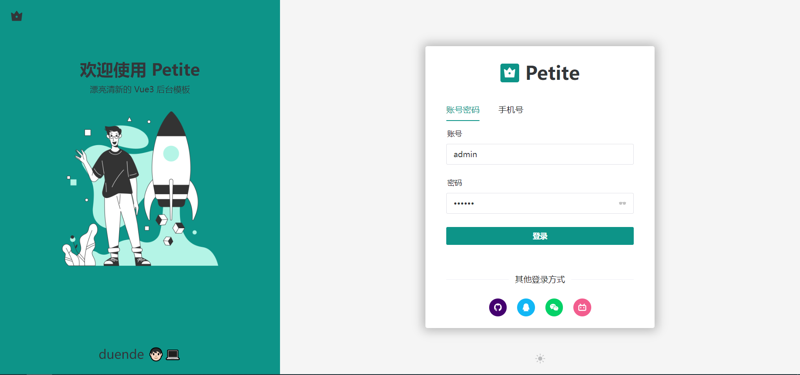
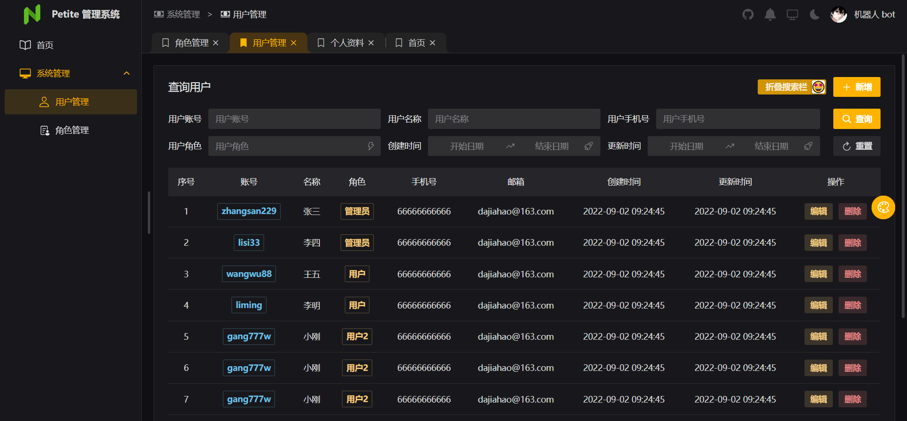
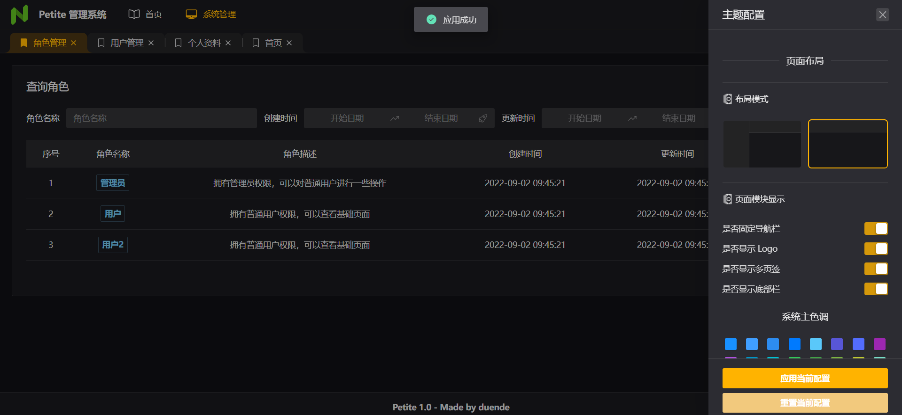
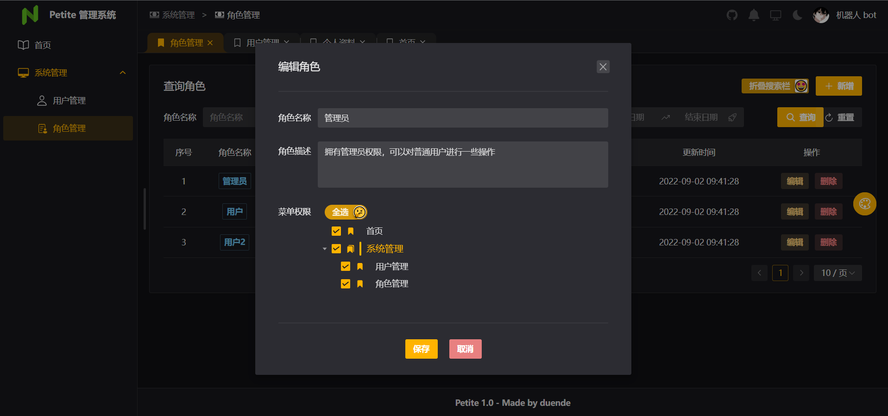

# Petite

> Tips: 这是一个使用 vue3 搭配 Naive Ui 实现的一个简易后台管理系统模块，可以被用来当作是项目的脚手架。页面风格清新，可以自由配置。

*********

## 预览
<p align="center">
  
</p>

<p align="center">
  
</p>

<p align="center">
  
</p>

<p align="center">
  
</p>

[在线预览](https://petite.netlify.app/)

## 参考
- [Vitesse](https://github.com/antfu/vitesse/)
- [soybean-admin](https://github.com/honghuangdc/soybean-admin/)

## 技术栈
- 🤙🏻 Vue3 <setup>
- ⚡️ Vite2
- 🦾 TypeScript
- 🍍 Pinia
- 🔥 Vue-Router
- 🎨 Unocss
- 📥 unplugin-auto-import
- 🗒 unplugin-vue-components

## 功能点
* [x] 垂直、水平布局
* [x] 页面主题配置，包括『界面内容的显示』、『主题色更换』、『多页签配置』、『页面动画』等
* [x] 系统管理模块，包括『用户管理』、『角色管理』等
* [x] 个人设置模块，包括『个人资料修改』、『修改密码』等
* [x] 支持 `markdown`
* [x] 图表模块示例

## 如何启动？
```TypeScript
pnpm install
pnpm run dev
pnpm run build
```

## 作者
🧑🏻‍💻 Cosmoscatts 

## 最后
喜欢就麻烦给个 `star` （；´д｀）ゞ
